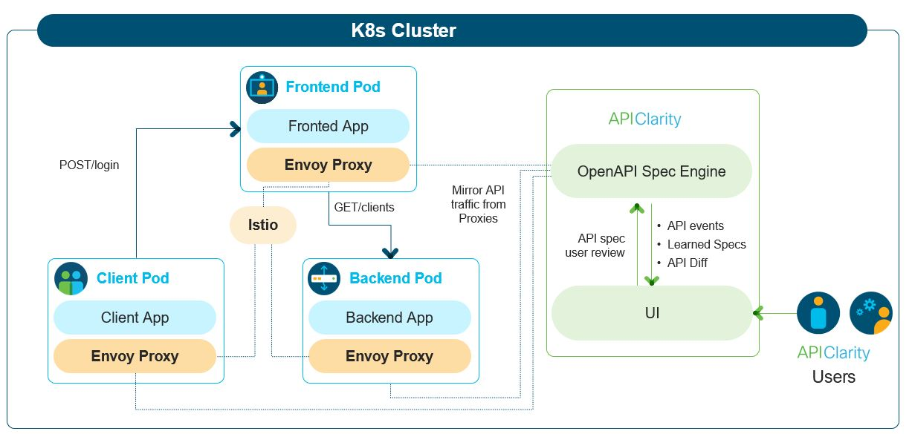

# 00. APIClarity overview

Open source for API traffic visibility in K8s clusters

## Microservices API challenges
Microservice applications interact via API’s with many other applications. To minimize risk, it is valuable to have visibility to the OpenAPI specifications and to understand any potential changes to that specification throughout the application lifecycle. However, obtaining OpenAPI specs can be challenging, particularly for external or legacy applications.

Proper OpenAPI specifications can be further complicated by microservices that use deprecated APIs (a.k.a. Zombie APIs)​ or microservices that use undocumented APIs (a.k.a. Shadow APIs).

Finally, it’s important to be able to obtain Open API specifications without code instrumentation or modifying existing workloads.

## Solution

* Capture all API traffic in an existing environment using a service-mesh framework​
* Construct the OpenAPI specification by observing the API traffic
* Allow the User to upload OpenAPI spec, review, modify and approve generated OpenAPI specs​
* Alert the user on any difference between the approved API specification and the one that is observed in runtime, detects shadow & zombie APIs​​
* UI dashboard to audit and monitor the API findings

