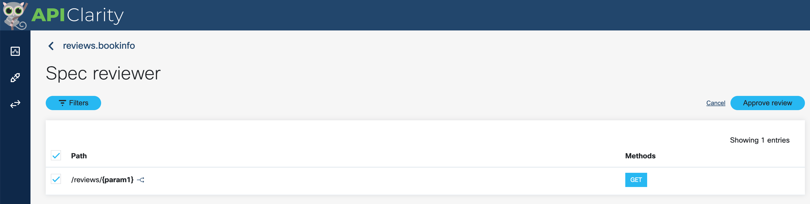

# 03. Application API analysis

Now, let's install the user application bookinfo.

The application displays information about a book, similar to a single catalog entry of an online book store. Displayed on the page is a description of the book, book details (ISBN, number of pages, and so on), and a few book reviews.

The Bookinfo application is broken into four separate microservices:

* productpage. The productpage microservice calls the details and reviews microservices to populate the page.
* details. The details microservice contains book information.
* reviews. The reviews microservice contains book reviews. It also calls the ratings microservice.
* ratings. The ratings microservice contains book ranking information that accompanies a book review.

There are 3 versions of the reviews microservice:

* Version v1 doesn’t call the ratings service.
* Version v2 calls the ratings service, and displays each rating as 1 to 5 black stars.
* Version v3 calls the ratings service, and displays each rating as 1 to 5 red stars.

The end-to-end architecture of the application is shown below.


As the application architecture is based on micro-services which use REST APIs for inter communication,
APIClarity can analyse it.

[Locust](https://docs.locust.io/en/stable/#) is deployed as part of the application to simulate periodic user requests.

## Task 1. Deploy BookInfo Application

Run the following command to install the BookInfo application:

```bash
kubectl apply -f $HOME/lab/bookinfo/bookinfo.yaml --namespace=bookinfo
```

You should have a similar output:

```console
service/details created
serviceaccount/bookinfo-details created
deployment.apps/details-v1 created
service/ratings created
serviceaccount/bookinfo-ratings created
deployment.apps/ratings-v1 created
service/reviews created
serviceaccount/bookinfo-reviews created
deployment.apps/reviews-v1 created
deployment.apps/reviews-v2 created
deployment.apps/reviews-v3 created
service/productpage created
serviceaccount/bookinfo-productpage created
deployment.apps/productpage-v1 created
configmap/reviews-inject-config created
deployment.apps/reviews-inject-v1 created
```

## Task 2. Analyse API traffic on APIClarity

Open the web UI of APIClarity. Refresh the page if you don't find captured traffic.

Observe the graph. Multiple user requests are automcatically simulated. This generates several hundreds of API calls every second. None of the detected calls are known by APIClarity. Thus, they are defined as *New APIs*.


## Task 3. Reconstruct API schema.

Under the API inventory you will find three discovered APIs:

* reviews.bookinfo
* ratings.bookinfo
* details.bookinfo


Use APIClarity's capability to reconstruct an OpenAPI schema based on the captured traffic.
Reconstruct the schema for the three APIs.


Click all paths and approve review.



Choose OAS V3


Once the schema is generated, you can review it in Swagger.


## Task 4. Analysis of API difference

Once a schema is loaded by the user or reconstructed by APIClarity, the application is using to compare running traffic towards the blueprint.

Use the API Events page to find for traffic which does not respect the schema:


Review an event with alert.


You will find that this particular API call does not respect the generated schema - several parameters are missing.