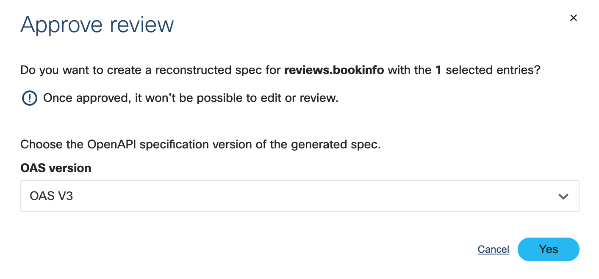

# 03. Application API analysis

## Task 3. Deploy BookInfo Application

Run the following command to install the BookInfo application:

```bash
kubectl apply -f $HOME/lab/bookinfo/bookinfo.yaml --namespace=bookinfo
```

You should have a similar output:

```console
service/details created
serviceaccount/bookinfo-details created
deployment.apps/details-v1 created
service/ratings created
serviceaccount/bookinfo-ratings created
deployment.apps/ratings-v1 created
service/reviews created
serviceaccount/bookinfo-reviews created
deployment.apps/reviews-v1 created
deployment.apps/reviews-v2 created
deployment.apps/reviews-v3 created
service/productpage created
serviceaccount/bookinfo-productpage created
deployment.apps/productpage-v1 created
configmap/reviews-inject-config created
deployment.apps/reviews-inject-v1 created
```

## Task 4. Analyse API traffic on APIClarity

Open the web UI of APIClarity. Refresh the page if you don't find captured traffic.


## Task 5. Reconstruct API schema.

Under the API inventory you will find three discovered APIs:

* reviews.bookinfo
* ratings.bookinfo
* details.bookinfo


Use APIClarity's capability to reconstruct an OpenAPI schema based on the captured traffic.
Reconstruct the schema for the three APIs.


Click all paths and approve review.


Choose OAS V3



Once the schema is generated, you can review it in Swagger.


## Task 6. Analysis of API difference

Once a schema is loaded by the user or reconstructed by APIClarity,
The application is using to compare running traffic towards the blueprint.

Use the API Events page to find for traffic which does not respect the schema:


Review an event with alert.


To approve the diff,