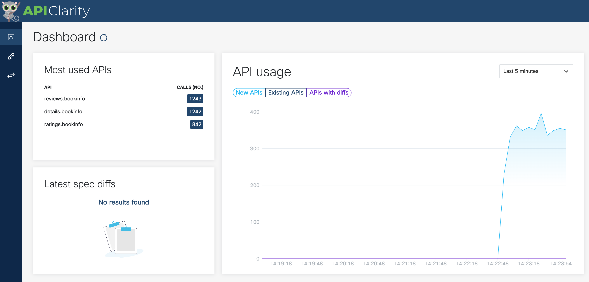
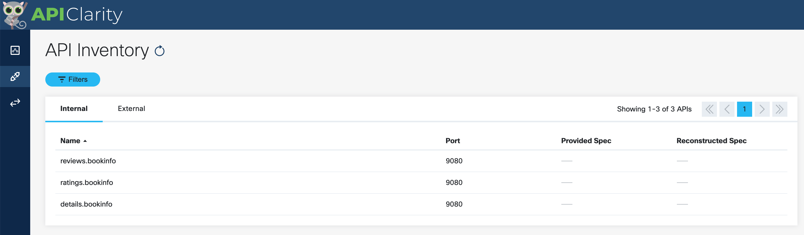
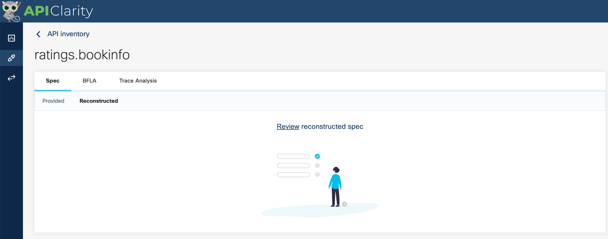
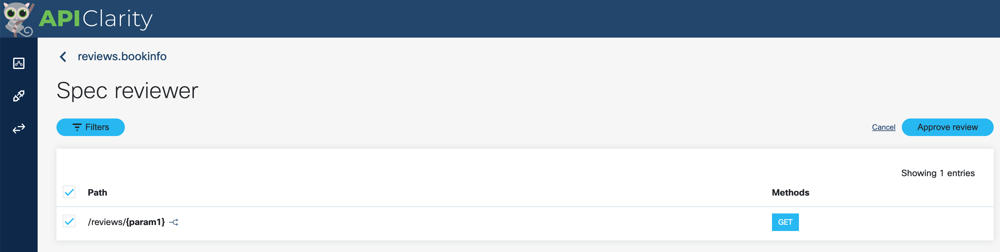
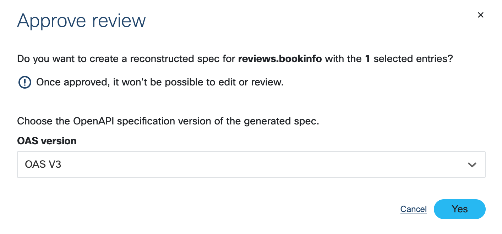
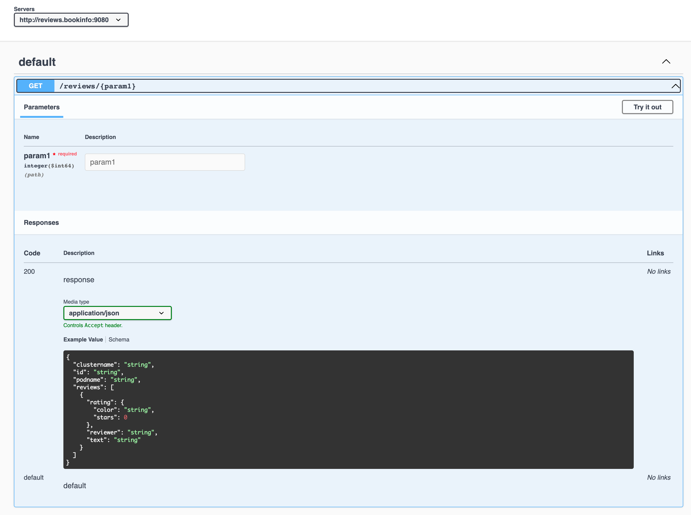
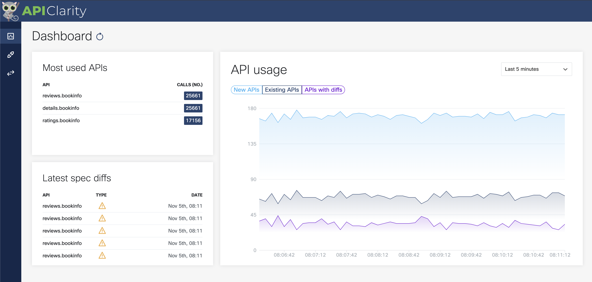
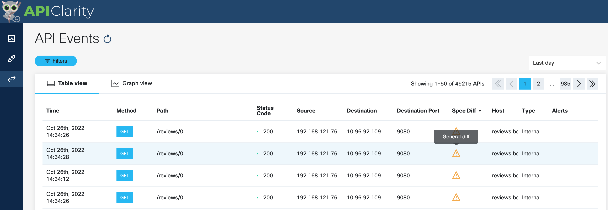
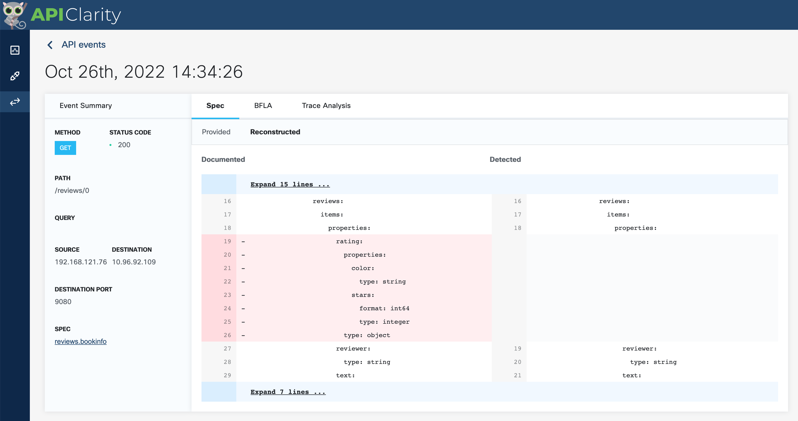

# 04. Analyse API traffic with APIClarity

## Task 1. Analyse API traffic on APIClarity

Open the web UI of APIClarity. Refresh the page if you don't find captured traffic.

Observe the graph. Multiple user requests are automcatically simulated. This generates several hundreds of API calls every second. None of the detected calls are known by APIClarity. Thus, they are defined as *New APIs*.

## Task 2. Reconstruct API schema.

Under the API inventory you will find three discovered APIs:

* reviews.bookinfo
* ratings.bookinfo
* details.bookinfo

Use APIClarity's capability to reconstruct an OpenAPI schema based on the captured traffic.
Reconstruct the schema for the three APIs.

Click all paths and approve review.

Choose OAS V3

Once the schema is generated, you can review it in Swagger. Select `see on Swagger`:

You can then review the response schema:

## Task 3. Analysis of API difference

Once a schema is loaded by the user or reconstructed by APIClarity, the application is using to compare running traffic towards the blueprint.

The general Dashboard shows now:

- New APIs: API calls for which we haven't approve the specification yet
- Existing APIs: API calls compliant with specification (approved)
- APIs with diffs: API calls not compliant with specification

You can also use the API Events page to find traffic which does not respect the schema:

You can review and inspect the deviation to the specification:

You will find that this particular API call does not respect the generated schema - several parameters are missing. The specification deviation is due as different `reviews` application releases are deployed and load balanced. One release is missing the stars and color properties and another one is missing the color property.
